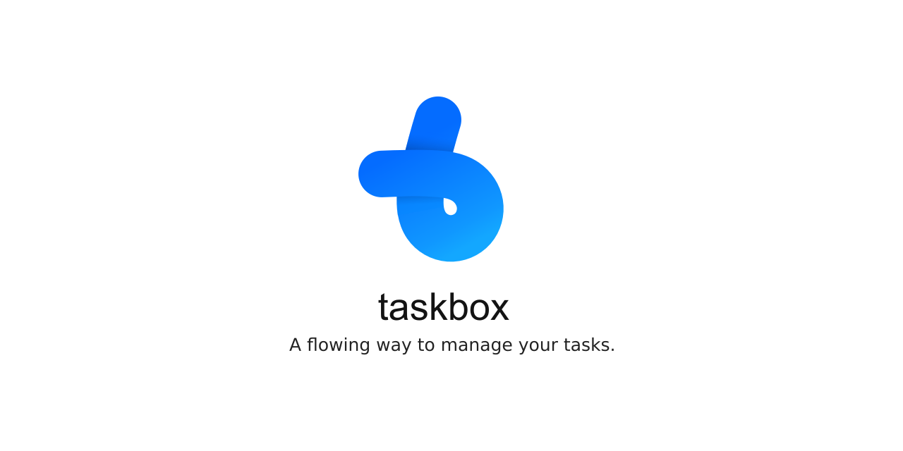

#   taskbox
A flowing way to manage your tasks.

- The goal of the taskbox project is to create a tool for track, guide and facilitate small or complex tasks. Example: companies process workflows, digital assets creation, products, public actions like nature recovering actions, etc.
- Be node based by default and module architectured, in order to developers create their on workflows.
- Ultimatelly create a taskbox node based OS for a dedicated portable device.

If you like the concept and want to colaborate to this project, please get in touch.

## Project setup
```
npm install
```

### Compiles and hot-reloads for development
```
npm run electron:serve
```

### Compiles and minifies for production
```
npm run electron:build
```

### Lints and fixes files
```
yarn lint
```

## Add tasks


## Work On Tasks


## Analyse Progress


## Template your tasks


## Pack your project in a zip file


## Membership with personal tasks, members management and messages.


## Social area to publicate templates, tasks, histories and portifolios.


## To Do
```

-Due system.
-Increase the number of task types, including:
    - Text module (*nodes).
    - Forms module.
    - Math module.
    - Code module.
    - 2d/3d graph module.
    - etc.
-Implement the input/output system, allowing data to pass through the boxes.
-Notification.
```

